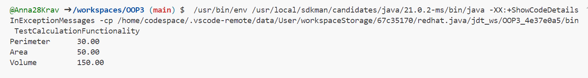
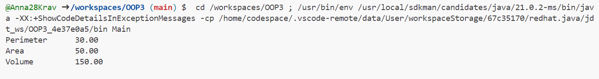

# OOP3

# **Завдння 4**

**3.1) За основу використовувати вихідний текст проекту попередньої лабораторної роботи Використовуючи шаблон проектування Factory Method (Virtual Constructor), розширити ієрархію похідними класами, реалізують методи для подання результатів у вигляді текстової таблиці. Параметри відображення таблиці мають визначатися користувачем:**

**Код CalculationData:**
````java
import java.io.Serializable;

// Клас, що представляє дані для обчислень
public class CalculationData implements Serializable {
    private static final long serialVersionUID = 1L;
    private double length;
    private double width;
    private double height;

    // Конструктор класу
    public CalculationData(double length, double width, double height) {
        this.length = length;
        this.width = width;
        this.height = height;
    }

    // Методи для обчислення периметру, площі та об'єму
    public double calculatePerimeter() {
        return 2 * (length + width);
    }

    public double calculateArea() {
        return length * width;
    }

    public double calculateVolume() {
        return length * width * height;
    }

    // Геттери для отримання параметрів
    public double getLength() {
        return length;
    }

    public double getWidth() {
        return width;
    }

    public double getHeight() {
        return height;
    }

    // Виведення результатів у текстовому вигляді
    public String displayResults(CalculationResultDisplay display) {
        return display.displayResults(this);
    }
}
````

**Код CalculationDataFactory:**
````java
// Фабрика для CalculationData
public interface CalculationDataFactory {
    CalculationData createCalculationData(double length, double width, double height);
}
````


**3.2) Продемонструвати заміщення (перевизначення, overriding), поєднання (перевантаження, overloading), динамічне призначення методів (Пізнє зв'язування, поліморфізм, dynamic method dispatch).:**

**Код CalculationDataFactoryImpl:**
````java
// Реалізація фабрики для CalculationData
public class CalculationDataFactoryImpl implements CalculationDataFactory {
    @Override
    public CalculationData createCalculationData(double length, double width, double height) {
        return new CalculationData(length, width, height);
    }
}
````

**Код TextCalculationResultDisplay:**
````java
// Клас для відображення результатів обчислень у вигляді текстової таблиці з заданими параметрами
public class TextTableCalculationResultDisplay implements CalculationResultDisplay {
    private String tableFormat;

    // Конструктор класу
    public TextTableCalculationResultDisplay(String tableFormat) {
        this.tableFormat = tableFormat;
    }

    // Метод для відображення результатів у вигляді текстової таблиці
    @Override
    public String displayResults(CalculationData data) {
        StringBuilder result = new StringBuilder();
        result.append(String.format(tableFormat, "Perimeter", data.calculatePerimeter())).append("\n");
        result.append(String.format(tableFormat, "Area", data.calculateArea())).append("\n");
        result.append(String.format(tableFormat, "Volume", data.calculateVolume())).append("\n");
        return result.toString();
    }
}
````


**3.3) Забезпечити діалоговий інтерфейс із користувачем:**

**Код CalculationResultDisplay:**
````java
// Інтерфейс для "фабрикованих" об'єктів, що представляє набір методів для відображення результатів обчислень
public interface CalculationResultDisplay {
    String displayResults(CalculationData data);
}
````


**3.4) Розробити клас для тестування основної функціональності:**

**Код TestCalculationFunctionality:**
````java
public class TestCalculationFunctionality {

    // Метод для тестування обчислень та виведення результатів
    public static void testCalculationAndDisplay() {
        // Створюємо об'єкт CalculationData через фабрику
        CalculationDataFactory factory = new CalculationDataFactoryImpl();
        CalculationData data = factory.createCalculationData(10.0, 5.0, 3.0);

        // Виконуємо обчислення та виводимо результати
        CalculationResultDisplay display = new TextTableCalculationResultDisplay("%-15s%-10.2f");
        System.out.println(data.displayResults(display));
    }

    // Додайте інші методи для тестування різних аспектів функціональності

    public static void main(String[] args) {
        // Викликаємо методи для тестування різних аспектів програми
        testCalculationAndDisplay();
    }
}
````

**Фото роботи програми:**




**3.5) Використати коментарі для автоматичної генерації документації засобами javadoc:**

**Код Main:**
````java
// Основний клас програми
public class Main {
    public static void main(String[] args) {
        // Діалоговий інтерфейс з користувачем
        // Приклад створення об'єкта CalculationData через фабрику та відображення результатів у вигляді текстової таблиці
        CalculationDataFactory factory = new CalculationDataFactoryImpl();
        CalculationData data = factory.createCalculationData(10.0, 5.0, 3.0);

        // Відображення результатів у вигляді текстової таблиці з заданими параметрами
        String tableFormat = "%-15s%-10.2f"; // Формат таблиці
        CalculationResultDisplay display = new TextTableCalculationResultDisplay(tableFormat);
        System.out.println(data.displayResults(display));
    }
}
````

**Фото роботи програми:**

